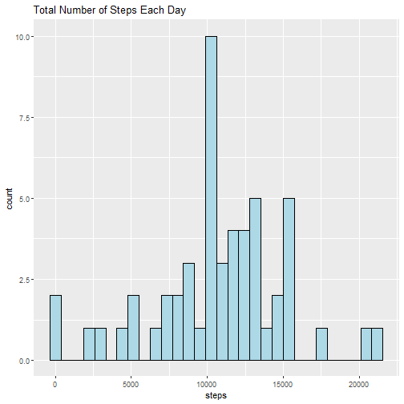
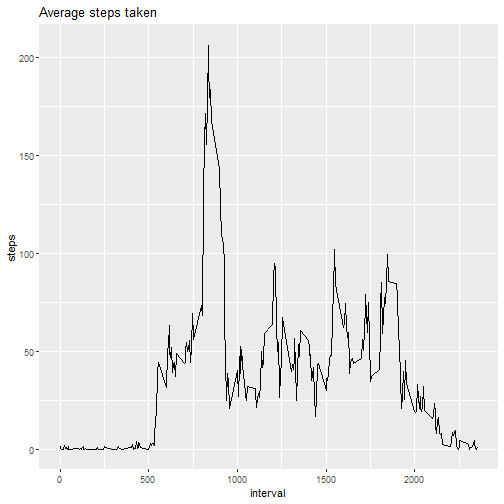
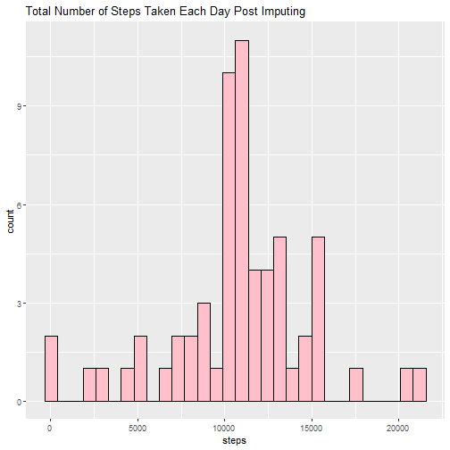
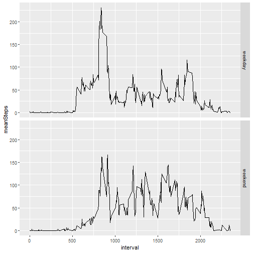

# R Markdown document

This assignment makes use of data from a personal activity monitoring device. This device collects data at 5 minute intervals through out the day. The data consists of two months of data from an anonymous individual collected during the months of October and November, 2012 and include the number of steps taken in 5 minute intervals each day.

The data for this assignment can be downloaded from [here](https://d396qusza40orc.cloudfront.net/repdata%2Fdata%2Factivity.zip).

**Dataset**: Activity monitoring data
 
The variables included in this dataset are:

**Steps**: Number of steps taking in a 5-minute interval (missing values are coded as NA)

**Date**: The date on which the measurement was taken in YYYY-MM-DD format.

**Interval**: Identifier for the 5-minute interval in which measurement was taken.

The dataset is stored in a comma-separated-value (CSV) file and there are a total of 17,568 observations in this dataset.

1.Downloading the data


``` r
temp <- tempfile()
download.file("https://d396qusza40orc.cloudfront.net/repdata%2Fdata%2Factivity.zip", temp)
activity <- read.csv(unz(temp, "activity.csv"), header = TRUE, colClasses = c("numeric", "Date", "numeric"))
unlink(temp)
head(activity)
```

```
##   steps       date interval
## 1    NA 2012-10-01        0
## 2    NA 2012-10-01        5
## 3    NA 2012-10-01       10
## 4    NA 2012-10-01       15
## 5    NA 2012-10-01       20
## 6    NA 2012-10-01       25
```
 Excluding NAs

``` r
activity_new <- na.omit(activity)
head(activity_new)
```

```
##     steps       date interval
## 289     0 2012-10-02        0
## 290     0 2012-10-02        5
## 291     0 2012-10-02       10
## 292     0 2012-10-02       15
## 293     0 2012-10-02       20
## 294     0 2012-10-02       25
```
2. Histogram of the total number of steps


``` r
library(ggplot2)
StepsPerDay <- aggregate(steps ~ date, activity_new,sum)
head(StepsPerDay)
```

```
##         date steps
## 1 2012-10-02   126
## 2 2012-10-03 11352
## 3 2012-10-04 12116
## 4 2012-10-05 13294
## 5 2012-10-06 15420
## 6 2012-10-07 11015
```


``` r
ggplot(StepsPerDay) + geom_histogram(aes(steps),  fill = "lightblue", col="black") +ggtitle("Total Number of Steps Each Day")
```

```
## `stat_bin()` using `bins = 30`. Pick better value
## `binwidth`.
```


3. Mean and median number of steps taken each day.


``` r
summary(StepsPerDay)
```

```
##       date                steps      
##  Min.   :2012-10-02   Min.   :   41  
##  1st Qu.:2012-10-16   1st Qu.: 8841  
##  Median :2012-10-29   Median :10765  
##  Mean   :2012-10-30   Mean   :10766  
##  3rd Qu.:2012-11-16   3rd Qu.:13294  
##  Max.   :2012-11-29   Max.   :21194
```
4. Time series plot of the average number of steps taken


``` r
StepsPerInterval <- aggregate(steps~interval, activity_new, mean)
ggplot(data = StepsPerInterval) + geom_line(aes(interval, steps))+ ggtitle("Average steps taken")
```


5.The 5-minute interval that, on average, contains the          maximum number of steps


``` r
StepsPerInterval[which.max(StepsPerInterval$steps),]
```

```
##     interval    steps
## 104      835 206.1698
```
 6. Code to describe and show a strategy for imputing missing     data.
    How many missing values are in the data set?
    

``` r
colSums(is.na(activity))
```

```
##    steps     date interval 
##     2304        0        0
```
      Deleting rows with missing data can distort statistical representation of the data.The missing data can be imputed several ways.I imputed NA with the data from the matching intervals.
    

``` r
activityImp <- activity
activityImp$steps <- ifelse(is.na(activityImp$steps) == TRUE, StepsPerInterval$steps[StepsPerInterval$interval %in% activityImp$interval], activityImp$steps)
head(activityImp)
```

```
##       steps       date interval
## 1 1.7169811 2012-10-01        0
## 2 0.3396226 2012-10-01        5
## 3 0.1320755 2012-10-01       10
## 4 0.1509434 2012-10-01       15
## 5 0.0754717 2012-10-01       20
## 6 2.0943396 2012-10-01       25
```
 7. Histogram of the total number of steps taken each day after      missing values are imputed.   
 

``` r
activityImp2 <- aggregate(steps~date, activityImp, sum)
ggplot(activityImp2) + geom_histogram(aes(steps), fill ="pink", col = "black")+ ggtitle("Total Number of Steps Taken Each Day Post Imputing")
```

```
## `stat_bin()` using `bins = 30`. Pick better value
## `binwidth`.
```



``` r
summary(activityImp2)
```

```
##       date                steps      
##  Min.   :2012-10-01   Min.   :   41  
##  1st Qu.:2012-10-16   1st Qu.: 9819  
##  Median :2012-10-31   Median :10766  
##  Mean   :2012-10-31   Mean   :10766  
##  3rd Qu.:2012-11-15   3rd Qu.:12811  
##  Max.   :2012-11-30   Max.   :21194
```
As exprected the statistical values without missing data and with missing data look very similar. 

 8. Panel plot comparing the average number of steps taken per 5-minute interval across weekdays and weekends
 

``` r
activityImp$day_type <- ifelse(weekdays(activityImp$date) %in% c("Saturday", "Sunday"), "weekend", "weekday")
library(tidyverse)
```

```
## ── Attaching core tidyverse packages ────────────────
## ✔ dplyr     1.1.4     ✔ readr     2.1.5
## ✔ forcats   1.0.1     ✔ stringr   1.5.2
## ✔ lubridate 1.9.4     ✔ tibble    3.3.0
## ✔ purrr     1.1.0     ✔ tidyr     1.3.1
## ── Conflicts ─────────────── tidyverse_conflicts() ──
## ✖ dplyr::filter() masks stats::filter()
## ✖ dplyr::lag()    masks stats::lag()
## ℹ Use the conflicted package (<http://conflicted.r-lib.org/>) to force all conflicts to become errors
```

``` r
activityImp3 <- activityImp %>% group_by(interval, day_type) %>% summarise(meanSteps = mean(steps))
```

```
## `summarise()` has grouped output by 'interval'. You
## can override using the `.groups` argument.
```

``` r
head(activityImp3)
```

```
## # A tibble: 6 × 3
## # Groups:   interval [3]
##   interval day_type meanSteps
##      <dbl> <chr>        <dbl>
## 1        0 weekday     2.25  
## 2        0 weekend     0.215 
## 3        5 weekday     0.445 
## 4        5 weekend     0.0425
## 5       10 weekday     0.173 
## 6       10 weekend     0.0165
```
 Graph the data:
 

``` r
ggplot(activityImp3) + geom_line(aes(interval, meanSteps)) + facet_grid(day_type~.)
```


 


